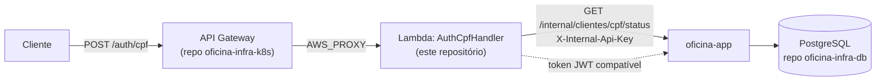

# oficina-auth-lambda

Function serverless (AWS Lambda, Java 21) que autentica clientes da oficina
mecânica por CPF, emitindo um JWT aceito pela aplicação principal
(`oficina-app`). Um dos quatro repositórios do projeto Oficina.

## Propósito

Implementa o requisito "Function Serverless para autenticação": recebe um
CPF, valida seu formato, consulta a aplicação principal para saber se aquele
cliente existe e está ativo, e — se estiver apto — emite um token JWT que as
demais rotas da aplicação aceitam.

## Tecnologias

- Java 21
- AWS Lambda (`aws-lambda-java-core`/`aws-lambda-java-events`)
- `io.jsonwebtoken` (jjwt) — mesmo algoritmo/segredo do `JwtService` da
  aplicação principal
- Jackson (serialização JSON)
- JUnit 5 + Mockito (testes)
- Terraform (`hashicorp/aws`) para a função Lambda e o papel IAM
- Maven (build e empacotamento via `maven-shade-plugin`)

## O que faz

1. Recebe `POST /auth/cpf` via AWS API Gateway (HTTP API, provisionado no
   repo `oficina-infra-k8s`) com corpo `{"cpf": "..."}`.
2. Valida o formato do CPF (dígito verificador).
3. Consulta `GET {INTERNAL_STATUS_BASE_URL}/{cpf}/status` na aplicação
   principal (endpoint interno protegido por `X-Internal-Api-Key`).
4. Se apto, emite um JWT HS256 com `sub`=CPF e claim `tipo=CLIENTE`, usando o
   mesmo segredo (`JWT_SECRET`) configurado na aplicação principal.
5. Responde `200 {"token": "..."}`, `400` (CPF inválido), `401` (cliente
   inexistente ou inativo — mensagem genérica, evita enumerar CPFs) ou `500`
   (falha ao consultar a aplicação principal).

## Variáveis de ambiente (runtime do Lambda)

| Variável | Obrigatória | Descrição |
|---|---|---|
| `JWT_SECRET` | sim | Mesmo valor de `jwt.secret`/`JWT_SECRET` do `oficina-app` |
| `JWT_EXPIRATION_MS` | não (default `1800000`) | TTL do token emitido, em ms |
| `INTERNAL_API_KEY` | sim | Mesmo valor de `app.internal.api-key`/`APP_INTERNAL_API_KEY` do `oficina-app` |
| `INTERNAL_STATUS_BASE_URL` | sim | URL até `/internal/clientes` do `oficina-app` (sem barra final) |

Em produção, `JWT_SECRET` e `INTERNAL_API_KEY` devem vir do mesmo AWS Secrets
Manager usado pelo `oficina-app` — nunca hardcoded no Terraform.

## Build e testes

```bash
mvn clean test      # 14 testes: CpfValidatorTest, JwtIssuerTest, AuthCpfHandlerTest
mvn package          # gera target/oficina-auth-lambda.jar (fat jar via shade)
```

O jar gerado é o próprio artefato de deploy — AWS Lambda Java aceita um
`.jar` como pacote de implantação diretamente.

## Deploy

```bash
mvn package
cd infra/terraform/environments/dev
cp terraform.tfvars.example terraform.tfvars   # preencher os valores
terraform init
terraform apply -var-file=terraform.tfvars
```

Outputs relevantes (`lambda_function_name`, `lambda_invoke_arn`) são
consumidos pelo repositório `oficina-infra-k8s` para configurar a rota
`POST /auth/cpf` do API Gateway.

CI/CD (GitHub Actions):
- `.github/workflows/ci.yml` — testes + build em todo push/PR.
- `.github/workflows/deploy-infra.yml` — `terraform plan` sempre;
  `apply` automático apenas quando disparado manualmente com
  `terraform_auto_apply=true` (ambiente `production`, pode exigir aprovação
  manual configurando *required reviewers* nesse GitHub Environment).

Segredos esperados no GitHub (Settings → Secrets and variables → Actions):
`AWS_REGION`, `AWS_ROLE_TO_ASSUME`, `JWT_SECRET`, `APP_INTERNAL_API_KEY`,
`APP_PUBLIC_URL`.

## Arquitetura



Repositórios relacionados: `oficina-app` (valida o token emitido aqui),
`oficina-infra-k8s` (provisiona o API Gateway que roteia para este Lambda),
`oficina-infra-db` (banco usado pela aplicação principal).

## Branch protection

`main` protegida contra push direto; merge somente via Pull Request; deploy
(`deploy-infra.yml`) disparado manualmente após merge, com `apply` exigindo
confirmação explícita (`terraform_auto_apply=true`) e aprovação do ambiente
`production`.
